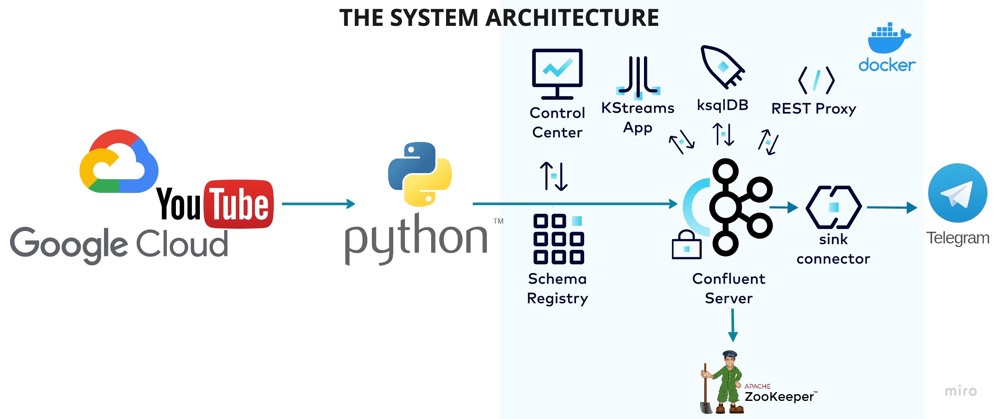

# Real-Time YouTube Analytics Streamed to Telegram

This Python-based project fetches real-time YouTube metrics - likes, views, comments, and favorites, and then streams this data via Kafka. 
ksqlDB was used for stream processing and the processed data is then sent to a Telegram bot for real-time notifications.

## System Architecture


## Requirements

- Python 3.12
- Kafka
- Telegram API
- Docker
- Confluent Containers (Zookeeper, Kafka, Schema Registry, Connect, ksqlDB, Control Center)

## Getting Started

 Make sure you have Docker and Confluent containers set up.

## Configuration

1. Open `config/config.local` and set the following:
    - `YOUTUBE_API_KEY`: Your YouTube API Key
    - `PLAYLIST_ID`: The YouTube playlist ID you want to track

2. Set up Kafka server address in the main script, by default, it's set to `localhost:9092`.

## Running the Code

1. Start Kafka and other Confluent services on Docker with
   ```bash
   docker compose up -d
   ``` 
2. Run the Python script.
    ```bash
    python youtube_analytics.py
    ```

## How It Works

1. Fetches data from YouTube API using the given playlist ID.
2. Sends this data to Kafka.
3. You should have another component (not included here but in the video) that reads from this Kafka topic and performs real-time analytics using ksqlDB.
4. The analytics results are then sent to Telegram for real-time notifications.

## Tools

#### 1. Zookeeper:
- Zookeeper is distributed continuation service that provides synchronization, config management, registry naming for distributed system.
- Also acts as backbone for Kafka cluster by managing the broadcast and keeping track of their status. 
- Anytime anything goes down, they are reported to the zookeeper and zookeeper distributes the services accordingly. 
- Kafka relies on zookeeper distributed system, helps to maintain its state broadcast.

#### 2. Kafka: 
- Distributed streaming platform that can subscribe to store and process streams of records in real-time. 
- It also includes producers, consumers, brokers and rest.

#### 3. Schema Registry: 
- Provides centralized repository for storing and retrieving schemas for Kafka topics. 
- This enables strong typing’s and schema evolution in your Kafka messages. 
- It is integrated with kafka to ensure that all data conforms to predefined schema. 

#### 4. Control Center: 
- Web based interface for managing and monitoring kafka clusters. 
- Interacts directly with broker.

#### 5. Confluent Connect: 
- Used to connect Kafka with other systems like databases, indexes, elastic search, etc.
- Helps to retrieve data from external systems into Kafka. 

#### 6. ksqlDB Server: 
- Distributed datastore built on Kafka, allowing to perform real-time computations/ kafka streams.